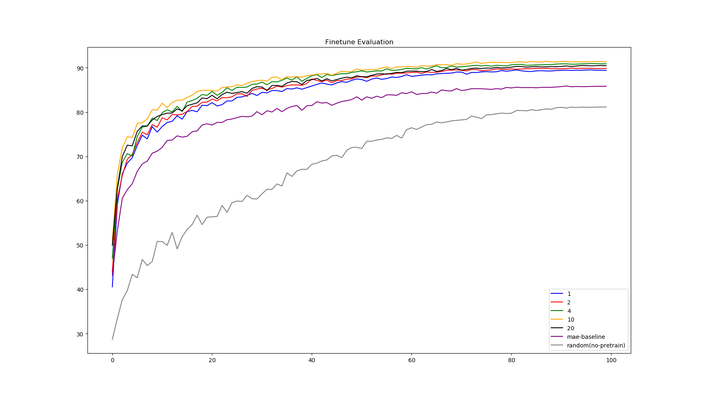
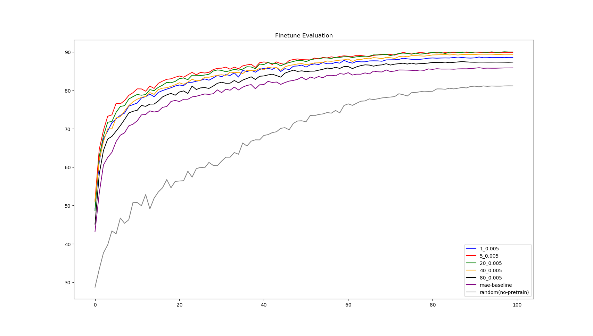
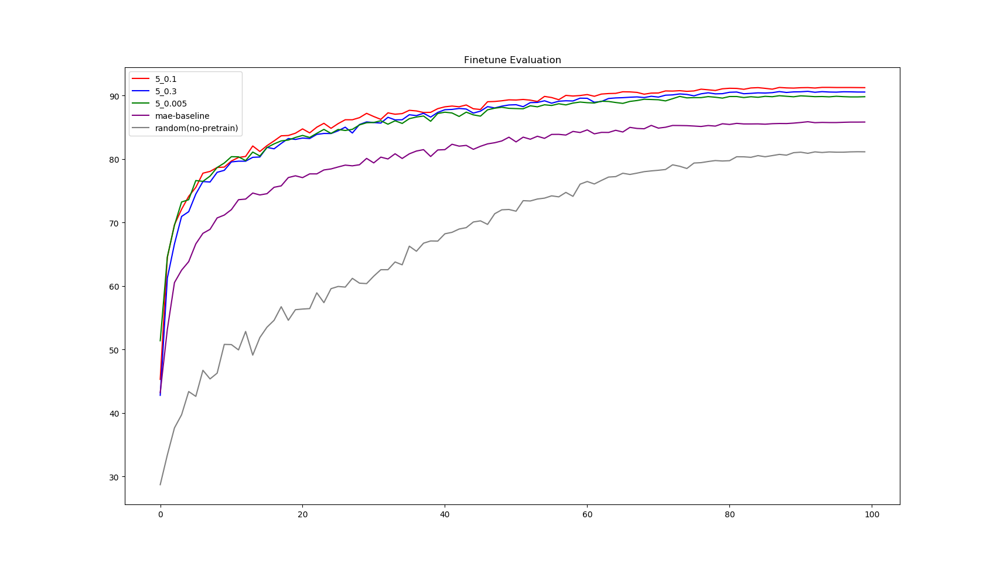
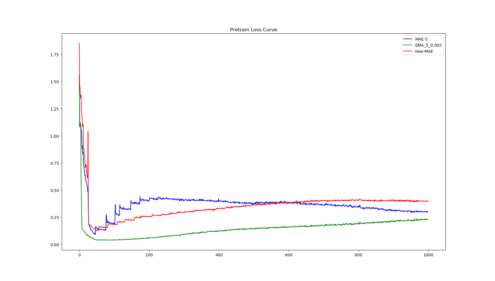
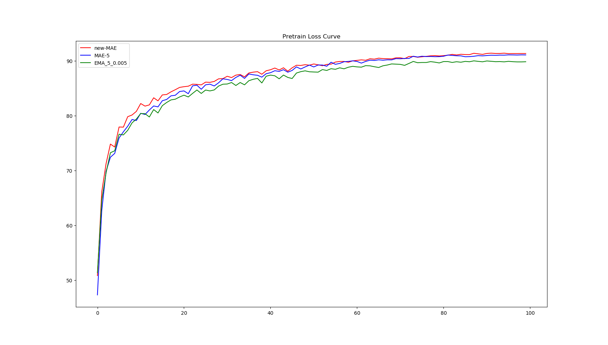

# Bootstrap-MAE Coding Report

Guanghe Li


## Abstract

In this project, we aim to improve the performance of MAE on downstream tasks(classification tasks) by changing the reconstruction target from original pixels to features extracted by a pretrained MAE encoder. The main contributions and findings are outlined as follows: 

- We have successfully developed and implemented the MAE-K algorithm. In the MAE-K algorithm, the target encoder is updated every K epochs to align with the parameters of training MAE, and the training MAE uses the output of the target encoder as its reconstruction target. Evaluation results demonstrate that MAE-K surpasses the original MAE baseline in performance on downstream classification tasks.
- We have also successfully implemented the EMA-MAE algorithm. In the EMA-MAE algorithm, the target encoder is updated using the exponential moving average of the training MAE. Experimental results show that EMA-MAE also outperforms the MAE baseline on downstream classification tasks. More than that, EMA-MAE achieves comparable results with MAE-K on fine-tune evaluation and outperforms MAE-K on linear evaluation. 
- The current MAE-K algorithm and EMA-MAE algorithm exhibit instability during unsupervised pretraining, potentially impacting final performance. To address this issue, we propose a novel solution called MAE-new, which integrates MAE-K and EMA-MAE into a unified framework. MAE-new incorporates both a fast-bootstrap loss and a slow-bootstrap loss to enhance stability and robustness during the training process. 

Experimental results of two versions of bootstrap-MAE are shown below: 

 

 

Implementation details, experiments and further analysis are in the following sections. 

## 1 Environment Setup 

Following the requirements, the code base is modified directly from MAE's official code base. The running environment remains consistent with MAE's official setup, with only two minor adjustments.

- Firstly, the version of the `timm` package in the original code base, 0.3.2, is slightly outdated and conflicted with our PyTorch version. To resolve this, we installed `timm==0.4.12` and removed version checks from the original code base. 

- Secondly, we encountered a minor issue when utilizing the SummaryWriter from TensorBoard. Thus, we did a modification in file ```lib/site-packages/torch/utils/tensorboard__init__.py``` and removed seven lines of code.  The removed codes are shown below: 

  ```python
  # file: lib/site-packages/torch/utils/tensorboard__init__.py
  import tensorboard
  from setuptools import distutils
  
  #LooseVersion = distutils.version.LooseVersion
  #if not hasattr(tensorboard, '__version__') or LooseVersion(tensorboard.__version__) < LooseVersion('1.15'):
  #     raise ImportError('TensorBoard logging requires TensorBoard version 1.15 or above')
  #del distutils
  #del LooseVersion
  #del tensorboard
  
  from .writer import FileWriter, SummaryWriter  # noqa: F401
  from tensorboard.summary.writer.record_writer import RecordWriter  # noqa: F401
  ```

  

## 2 Baseline Parameter Configuration   

The official MAE codebase is well-implemented, so we largely maintained the default parameters, making only a few modifications.

- Number of GPUs: Most experiments were conducted using a single RTX Titan Xp GPU, while a small portion of experiments were conducted on an A40 GPU. 
- Batch size: We opted for a batch size of 512, as we observed that larger batch sizes caused burden to the CPU.
- Training epochs: In accordance with specifications, pretraining takes 200 epochs, while finetuning takes 100 epochs.
- Network architecture: In accordance with specifications, we employed the architecture configurations of Deit-Tiny.
- Dataset: We use CIFAR10 dataset. Input images are standarlized by the dataset mean and std values. 


## 3 MAE Baseline 

Following the parameter configurations above, we pretrain an MAE baseline model on CIFAR10 dataset for 200 epochs, and then finetune it for 100 epochs to classify images. 

We compare the MAE baseline with a randomly initialized network(without MAE pretraining) to show that unsupervised pretraining benefits downstream classification task.

The finetune and linear evaluations are shown below:  


When pre-trained with MAE, the accuracy of classification task on CIFAR10 can reach 85.83% in fine-tune evaluation and 52.35 in linear evaluation. Without pretraining on MAE, the accuracy of classification task on CIFAR10 is 81.1% in fine-tune evaluation and 30.91 in linear evaluation. 

As shown above, pretraining an MAE model is able to boost downstream classification tasks by a huge margin, which shows the effectiveness of MAE baseline. 

## 4 MAE-K 

In MAE-K, we update the target network every K epochs in alignment with the parameter of the training network. As shown below, The selection of the hyperparameter K significantly impacts the final performance. 

In fine-tuning evaluation, MAE-K achieves optimal result of 91.38% of accuracy when K is set to 10, whereas during linear evaluation, the optimal performance of 57.2% of accuracy is observed when K is set to 20. 

Across fine-tuning evaluations, all versions of MAE-K outperform the MAE baseline. However, during linear evaluation, only MAE-K configurations with larger K values (4, 10, 20) surpass the baseline, while those with smaller K values (1, 2) underperform compared to the baseline algorithm. We highlight that during linear evaluation, the weights of the pre-trained encoder remain fixed and unchanged. As a result, the pre-trained encoder must be able to extract stable and convergent features for the classification head. Consequently, a larger value of K would facilitate the convergence of the trained model towards a target model, encouraging convergence and stability. Conversely, a smaller K could lead to oscillations in the reconstruction objective, hindering the convergence of the trained network.  




## 5 EMA-MAE 

In exponential moving average(EMA) version of MAE, the target encoder is updated every epoch to equal the exponential moving average of training MAE. In finetune evaluation, the accuracy can reach 91.25% while in linear evaluation, the accuracy can reach 60.46%. 

In EMA-MAE, there exists two key hyper parameters: Warmup starting epochs(WSE) and Exponential moving average(ema) coefficient $\tau$. Their detailed analysis are shown below: 

**Warmup starting epochs (WSE)**: Initially, the EMA-MAE model is trained to reconstruct pixels for WSE number of epochs, which is consistent with the original training objective of MAE. This initial phase is termed as "warmup-stage". Subsequently, following the warm-up stage, the EMA-MAE model is trained to bootstrap on the output of target encoder(exponential moving average of training EMA-MAE model) 

Determining the appropriate value for Warmup Starting Epochs (WSE) is crucial. The features generated by the target encoder becomes valuable only when the target MAE is capable of predicting masked pixels, i.e. understands the distribution of dataset. Therefore, rather than immediately bootstrapping on target encoder's output from beginning of training, it is important for the target network to initially acquire the capability to recover masked pixels. The parameter analysis below demonstrates that, when the EMA coefficient $\tau$ remains fixed as 0.005, WSE values of 5 and 20 yield optimal performance, underscoring the necessity of the warm-up phase.



 

**Exponential moving average coefficient $\tau$**:  The target encoder is updated according to the following equation: 
$\mathrm{MAE_{target}} = \mathrm{MAE_{target}} \times (1-\tau) + \mathrm{MAE_{train}} \times \tau$ 

This equation is applied to the target encoder for each epoch after the warmup-stage. The approach of using EMA to construct a target network in this work is very similar to the utilization of target Q-network in reinforcement learning. Following that, we opt the default value of $0.005$ as in Q-learning. This choice facilitates gradual updates to the target network, thereby mitigating instability in training. 

We conducted additional experiments to show how the value of $\tau$ effects the final performance. As illustrated below, during finetune evaluation, $\tau$ values of $0.1$ and $0.3$ consistently outperform the performance achieved with a $\tau$ value of $0.005$. However, in linear evaluation, a $\tau$ value of $0.005$ significantly surpasses the performance of the other values. We hypothesize that a smaller value of $\tau$ results in slower updates to the target network. This in turn encourages the trained MAE encoder to provide stable and convergent features for an input image. Such convergence in features proves advantageous for linear evaluation, given that the weights of the MAE encoder remain fixed and unchanged during linear evaluation. 


## 6 Improved version of Bootstrap-MAE

As illustrated above, both MAE-K and EMA-MAE demonstrate significant improvements over the MAE-baseline. However, both versions of bootstrap MAE still encounter issues with unstable pre-training. As shown below, in the pre-training stage of MAE-K, the target encoder changes every K epochs, which causes sudden change to the reconstruction objective. In the pre-training stage of EMA-MAE, the target encoder consistently changes and the reconstruction objective is never stable, resulting in the loss function failing to converge. Thus, updating the target encoder too frequent or too infrequent would both induce instability. 


We denote the loss of bootstrapping on the target encoder of MAE-K as $L_{slow}$ and the loss of bootstrapping on the target encoder of EMA-MAE as $L_{fast}$. We believe that optimizing the combination of both losses, $L=L_{fast}+\lambda L_{slow}$, would enhance overall performance. The intuition behind this lies in the observation that solely optimizing $L_{fast}$ (EMA-encoder) leads to a smooth training curve, but the target encoder changes every epoch, which may hinder convergence. Conversely, incorporating an additional loss term for reconstructing on an additional target encoder that updates every K epochs would stabilize the reconstruction objective (the encoder of target MAE-K only changes every K epochs). Here, $\lambda$ is an additional hyper parameter and we simply set it to the value of 0.2. 

We combine the training objective of MAE-5 and EMA-MAE with $\tau=0.005, \mathrm{WSE=5}$ together to form the training objective of new-MAE model. The new pre-training loss(in red) , with the loss being logged five times per epoch is shown below. It is evident that the new loss function is smoother compared to the MAE-K pre-training curve, and it converges within 200 epochs of pre-training.  



The finetuning and linear evaluation results are presented below. It is crucial to emphasize that the training objective of new-MAE is directly derived from MAE-5 and MAE-5-0.005. However, new-MAE exhibits superior performance in both finetuning and linear evaluations compared to both. This shows that adding an additional loss to stabilize training is beneficial to the overall performance. Nevertheless, it is noteworthy that although new-MAE outperforms MAE-5 and MAE-5-0.005 by a large margin in linear evaluation, the improvement on fine-tunining is not significant. 

 

 


## Conclusion

In this study, we have successfully implemented MAE-K and EMA-MAE, two bootstrapped versions of MAE. By altering the reconstruction objective from pixels to the output of a target encoder, bootstrap-MAE demonstrates enhanced performance compared to the original MAE. Empirical evaluations conducted on the CIFAR10 dataset illustrate a significant performance boost over the MAE baseline.

However, bootstrap-MAE faces the challenge of instability in the reconstruction objective, as different target networks may output varying features even when presented with the same image. To address this issue, we attempted to mitigate it by combining MAE-K and EMA-MAE, introducing both slow-bootstrap loss and fast-bootstrap loss. Empirical evaluations indicate that the enhanced version of bootstrap-MAE improves upon the original EMA-MAE and MAE-K, but the improvement is not significant in finetune evaluation, and adding an additional loss term also induces additional computational costs. For future work, exploring how to bootstrap on the target encoder while stabilizing training would be an interesting direction. 

