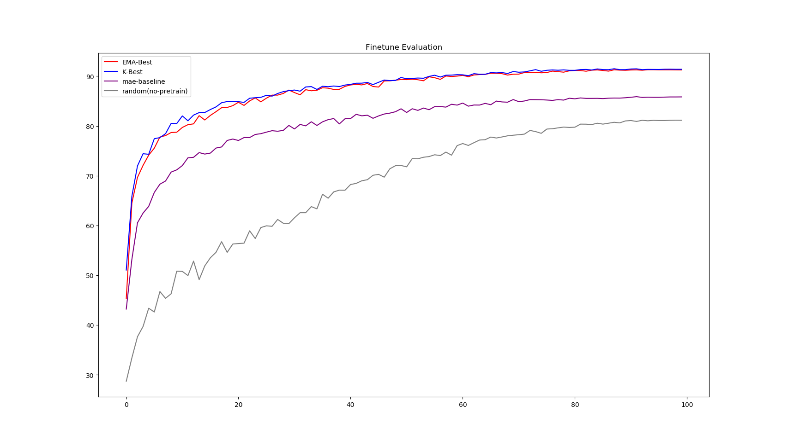

# Bootstrap-MAE Coding Report

Guanghe Li


## Abstract


In this project, we aim to improve the performance of MAE on downstream tasks(classification tasks) by changing the reconstruction target from original pixels to features extracted by a pretrained MAE encoder. The main contributions and findings are outlined as follows: 

- We implement a primary version of Bootstrap MAE(MAE-K) by adjusting the target encoder every K epochs during training. Evaluation results demonstrate that MAE-K surpasses the original MAE model in performance on downstream classification task. However, the training loss exhibits significant fluctuations, potentially constraining the overall efficacy of Bootstrap MAE.
- To address the fluctuation issue in MAE-K, we introduce an enhanced version EMA-MAE (Exponential Moving Average MAE), leveraging exponential moving average (EMA) to stabilize training. Experimental results exhibits that EMA-MAE outperforms MAE baseline and MAE-K algorithm by a large margin. 

Overall experimental results are shown below: 

 

 

Implementation details, experiments and further analysis are in the following sections. 

## 1 Environment Setup 


Following the requirements, the codebase is modified directly from MAE's official codebase. The running environment remains consistent with MAE's official setup, with only two minor adjustments.

- Firstly, the version of the `timm` package in the original codebase, 0.3.2, was slightly outdated and conflicted with our PyTorch version. To resolve this, we installed `timm==0.4.12` and removed version checks from the original codebase. 

- Secondly, we encountered a minor issue when utilizing the SummaryWriter from TensorBoard. Thus, we did a modification in file ```lib\site-packages\torch\utils\tensorboard__init__.py``` and removed seven lines of code.  The removed codes are shown below: 

  ```python
  # file: lib/site-packages/torch/utils/tensorboard__init__.py
  import tensorboard
  from setuptools import distutils
  
  #LooseVersion = distutils.version.LooseVersion
  #if not hasattr(tensorboard, '__version__') or LooseVersion(tensorboard.__version__) < LooseVersion('1.15'):
  #     raise ImportError('TensorBoard logging requires TensorBoard version 1.15 or above')
  #del distutils
  #del LooseVersion
  #del tensorboard
  
  from .writer import FileWriter, SummaryWriter  # noqa: F401
  from tensorboard.summary.writer.record_writer import RecordWriter  # noqa: F401
  ```

  

## 2 Baseline Parameter Configuration   

The official MAE codebase is well-implemented, so we largely maintained the default parameters, making only a few modifications.

- Number of GPUs: All experiments were conducted using a single RTX Titan GPU.
- Batch size: We opted for a batch size of 512, as we observed that larger batch sizes caused burden to the CPU.
- Training epochs: In accordance with specifications, pretraining takes 200 epochs, while finetuning takes 100 epochs.
- Network architecture: In accordance with specifications, we employed the architecture configurations of Deit-Tiny.
- Dataset: We use CIFAR10 dataset. Input images are standarlized by the dataset mean and std values. 


## 3 MAE Baseline 

Following the parameter configurations above, we pretrain an MAE baseline model on CIFAR10 dataset for 200 epochs, and then finetune it for 100 epochs to classify images. 

We compare the MAE baseline with a randomly initialized network to show that unsupervised pretraining benefits downstream classification task.

The finetune and linear evaluations are shown below: 


As shown above, pretraining an MAE model is able to boost downstream classification tasks by a huge margin, which shows the effectiveness of MAE baseline. 

## 4 MAE-K 


## 5 EMA-MAE 

In exponential moving average(EMA) version of MAE, the target encoder is updated every epoch equalling to the exponential moving average of trained MAE. 

In EMA-MAE, there exists two key hyperparameters: Warmup starting epochs(WSE) and Exponential moving average(ema) coefficient $\tau$. Their detailed analysis are shown below: 

**Warmup starting epochs (WSE)**: The EMA-MAE is first trained to reconstruct pixels for WSE number of epochs, which is consistent with the original training target of MAE. We refer to this stage as **warmup-stage**. Then, after the warm-up stage, the EMA-MAE is trained to bootstrap on the decoder output of exponential moving average(EMA) of trained MAE. 

We think it is important to find the proper value of Warmup starting epochs(WSE): The features generated by the target encoder is only valuable when the target MAE is capable of predicting masked pixels, i.e. understands the distribution of dataset. Thus, instead of performing EMA to the target encoder from the beggining, we think it is important for the target network to first learn how to recover masked pixels. The parameter study below shows that when the EMA coefficient $\tau$ is fixed, a WSE value of 5 and 20 performs best, which shows the necessity of warming up. 

**Exponential moving average coefficient $\tau$**:  The target encoder is updated with the following equation: 
$\mathrm{MAE_{target}} = \mathrm{MAE_{target}} \times \tau + \mathrm{MAE_{train}} \times (1 - \tau)$ 

This equation is applied to the target encoder for every epoch after the **warmup-stage**. The idea of using EMA to update target network is very similar to the target Q-network in reinforcement learning. Following that, I chose the default value of $0.995$ as in Q-learning, for it allows the target network to gradually be updated, avoiding sudden changes. 


 


## 6 Improved version of Bootstrap-MAE 


## Conclusion


